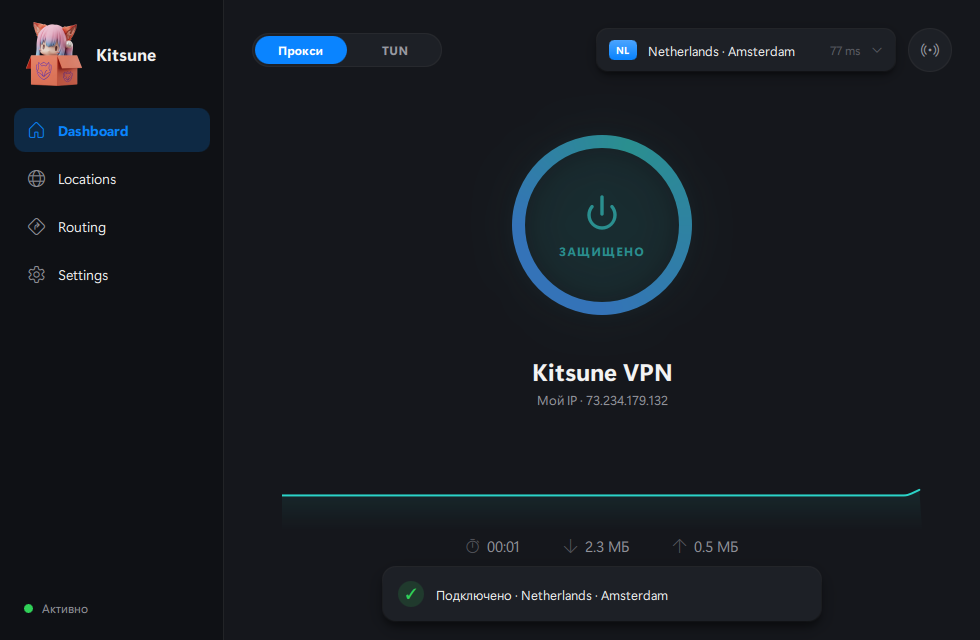
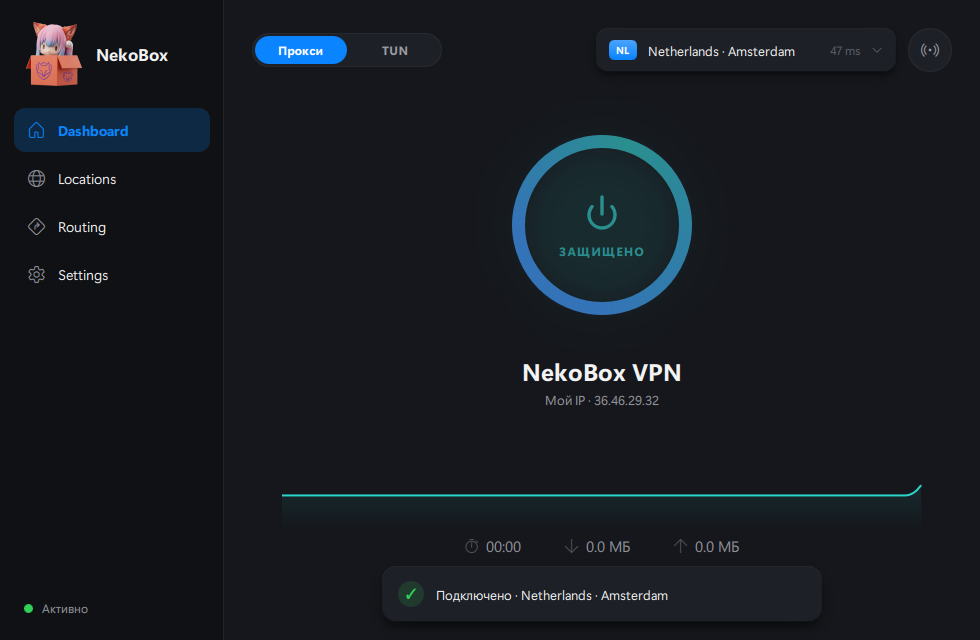

<div align="center">

# 🦊 Kitsune

**Элегантный, быстрый и понятный VPN-клиент для Windows.**

Минималистичный интерфейс в духе лучших лет Apple — плавные анимации,
сдержанная типографика, аккуратные подсказки. Движок на базе [sing-box](https://github.com/SagerNet/sing-box).



</div>

---

## ✨ Возможности

- **Подключение одним нажатием** — большое анимированное кольцо, мгновенный отклик, бесшовное переключение серверов.
- **Локации и подписки** — группы серверов, импорт по ссылке, обновление, поиск, сортировка по пингу, «Авто (лучший)», избранное.
- **Маршрутизация** — профили, финальный outbound, пресеты (обход LAN/региона, блок рекламы), правила с drag-сортировкой.
- **Гибкие настройки** — TUN/Proxy, DNS, sniffing, mux, протоколы (VLESS / VMess / Trojan / Shadowsocks / WireGuard).
- **Подписка задаёт настройки автоматически** — DNS/маршрутизация подтягиваются из подписки (можно отключить).
- **Системный трей** — подключение/отключение/смена сервера, живой пинг, анимированная иконка.
- **Глобальная горячая клавиша** — вкл/выкл VPN даже когда окно свёрнуто.
- **Темы** — тёмная, светлая и скрытая 🦊 **Kitsune** (мягкий фокс-огонь).
- **Поделиться** — ссылка + QR-код.

## 🎨 Тема Kitsune

<div align="center"></div>

## 🚀 Запуск

```bash
pip install PySide6 segno pillow
python app.py
```

Окно сворачивается в трей; при закрытии приложение продолжает работать в трее.

## 🛠 Технологии

- **UI:** PySide6 + QML (Qt Quick), кастомные компоненты и анимации.
- **Движок:** sing-box (планируется нативная интеграция), связь по Thrift.
- **Иконки:** Segoe Fluent Icons. **Шрифт:** Segoe UI Variable.

## 📦 Статус

Активная разработка. Текущая версия — рабочий прототип интерфейса с имитацией движка;
ведётся интеграция реального ядра.

## 📁 Структура

```
app.py            — точка входа, контроллер трея и жизненного цикла, бэкенд
qml/App/          — компоненты интерфейса (экраны, модалки, тема)
assets/           — иконка приложения и кадры анимации трея
gen_icon.py       — генерация иконки и кадров трея из исходного арта
```
